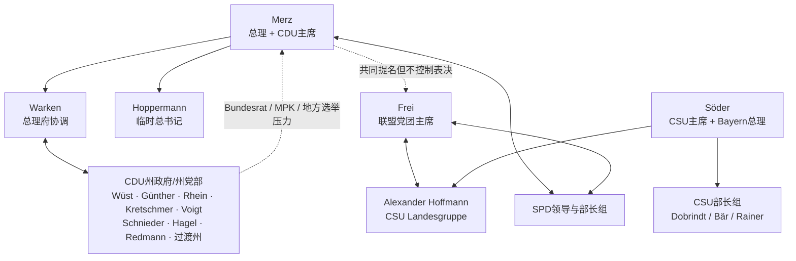

# 2026 年 7 月底 CDU/CSU 权力环境底稿

**观察截止：2026-07-31 23:59 CEST**  
**用途：未来情景模拟的初始环境；本文件不包含预测，也不把后来结果倒灌进来。**

## 一、先给结论：这不是一次简单的“换了三名部长”

Spahn 于 7 月 18 日辞去联盟党团主席后，发生的是一串跨机构的人事迁移：Frei 从总理府转任党团主席，Warken 从卫生部转任总理府，Linnemann 从党务转任卫生部，Hoppermann 临时接管 CDU 总书记，Bilger 从党团执行岗位转任交通部长，Amthor 进入总理府负责联邦—州协调。换人的同时，至少留下党团第一议会经理、体育国务部长和 CDU 总书记正式确认三处未闭合接口。

因此，7 月 31 日的真实结构是：

- Merz 仍同时掌握总理职位、CDU 主席职位和联邦部长提名权，形式资源没有下降；
- 但日常政府协调、议会执行和党务执行被分别交给 Warken、Frei、Hoppermann，三人都刚换岗，其中一人还是临时任命；
- Frei 获 170/185、即 91.9% 的党团票，这给了他独立的党团授权；他公开说党团要有“自己、自信的声音”；
- Söder/CSU 没有换自己的三名联邦部长，仍通过 Söder、Dobrindt、Alexander Hoffmann 三个接口进入联盟委员会和联盟党团；
- 州级 CDU 的反应不是一体化阵营：RLP 因 Patrick Schnieder 事件形成公开组织冲突，Sachsen 因 Schenderlein 和东部代表性问题公开抗议，NRW 因 Spahn 离任损失联邦权重，Hessen 则出现“内阁无 Hessen 人”的代表性问题；
- Berlin、Sachsen-Anhalt、Mecklenburg-Vorpommern 三场 9 月州选举使联邦人事争议立刻带有地方成本。

在模型里，这意味着不能再设置一个单一的 `CDU apparatus` 数值。至少要拆成：总理府协调、Konrad-Adenauer-Haus、联盟党团执行、CSU Landesgruppe、州党部/州党团、州政府及 Bundesrat/MPK 接口。

## 二、联邦内阁与 CDU 执行层

### 联邦内阁全表（按 7 月 31 日职位）

| 党 | 人 | 岗位 | 对 Union 权力环境的直接意义 |
|---|---|---|---|
| CDU | Friedrich Merz | 总理 | 内阁议程、部长提名、联盟委员会、CDU主席 |
| SPD | Lars Klingbeil | 副总理、财政 | 预算门与SPD联席主席；Merz最重要的联盟交易对手之一 |
| CSU | Alexander Dobrindt | 内政 | CSU旗舰部、移民安全、州内政部长会议接口 |
| CDU | Johann Wadephul | 外交 | 外交/安全平台；Schleswig-Holstein CDU联邦代表性 |
| SPD | Boris Pistorius | 国防 | 高公众平台、军费与安全议程 |
| CDU | Katherina Reiche | 经济与能源 | 增长、能源、产业政策；来自Brandenburg但非该州党组织控制节点 |
| SPD | Bärbel Bas | 劳工与社会 | 社保、养老金与工会接口；SPD联席主席 |
| CDU | Karin Prien | 教育、家庭、老年、妇女和青年 | Schleswig-Holstein来源、社会政策与州教育接口 |
| CDU | Karsten Wildberger | 数字化与国家现代化 | 跨部门改革；Connemann转入该部后组织容量上升 |
| CDU | Steffen Bilger | 交通 | 基建/铁路/州交通接口；从党团执行岗迁入 |
| SPD | Stefanie Hubig | 司法与消费者保护 | 法律审查与联盟制衡 |
| CSU | Dorothee Bär | 研究、技术与航天 | CSU未来产业平台 |
| SPD | Carsten Schneider | 环境、气候、自然保护与核安全 | 东部SPD代表性与气候政策 |
| CDU | Carsten Linnemann | 卫生 | 医保/护理改革；从党务执行迁入 |
| CSU | Alois Rainer | 农业、食品与Heimat | 农村、农民、市镇和手工业接口 |
| SPD | Reem Alabali-Radovan | 经济合作与发展 | 国际发展；Mecklenburg-Vorpommern代表性 |
| SPD | Verena Hubertz | 住房、城市发展与建设 | 住房与市镇投资接口 |
| CDU | Nina Warken | 特别任务部长、总理府主任 | 跨部、议会和联邦—州协调中枢 |

表中 SPD 人物不是本轮人格建模对象，但必须作为制度节点存在；否则会错误地把联合政府模拟成 CDU/CSU 单党政府。

### Friedrich Merz

**Observed facts**

- 联邦总理、CDU 联邦主席；依《基本法》第 64 条拥有向联邦总统提出部长任免建议的正式权力。
- 7 月 22 日与 Söder 共同提出 Frei 出任党团主席；7 月 24—29 日完成人事连锁调整。
- 换阁过程受到公开批评，焦点不只在换谁，也在 Patrick Schnieder 被告知将被替换而继任安排一度未闭合、各州和党内沟通不足。

**可调用资源**

- 最高行政议程与部长提名门；CDU 主席的党内议程、主席团和联邦执委会入口；总理媒体平台；与 SPD 领导层的联盟委员会接口。
- 仍可共同提名党团领导，但不能替代党团选举；Frei 的 91.9% 票意味着党团授权并非单纯来自总理。

**约束/损伤**

- RLP 州议会党团因 Schnieder 处理方式取消与 Merz 的计划会面；Sachsen 的 Kretschmer 公开批评 Schenderlein 被撤；多名 CDU 地方和联邦人物公开批评领导风格。
- 这是“权力资源强、转化效率受损”，不能误写为形式权力崩塌，也不能把媒体批评直接等同于失去多数。

### Nina Warken

从卫生部长转为总理府部长。这个岗位掌握跨部协调、总理决策准备、与议会、各州和社会团体的联络，是高中心度而不是单一政策部。她还在 CDU 主席团内。

模型上应给她很高的 **coordination access**，但不给未经检验的 **autonomous authority**：7 月底还没有足够行动样本证明，她能否在 Merz、Frei、SPD 部长和各州之间独立达成交换。

### Carsten Linnemann

从 CDU 总书记转任卫生部长，失去日常党务控制，获得卫生、医保、护理改革的部级执行资源。他过去的 Mittelstandsunion 网络、联邦议员身份和公众辨识度仍在，但不应继续把 Konrad-Adenauer-Haus 的工作人员和议程权记在他名下。

卫生部在 2026 年是高冲突、高交付压力岗位。它既可能提供“落实能力”的验证场，也可能消耗政治资本。报道中他对调任并未呈现主动争取的兴奋状态；这只能记为对调任过程的公开信号，不能直接推导动机。

### Franziska Hoppermann

7 月 27 日由 CDU 联邦执委会一致选为临时总书记，正式确认要等下一次党代会。她此前是联邦财务主管、Hamburg 联邦议员。

资源上，她立即获得党部、媒体协调、组织日程和选举支持的操作入口；约束是 `kommissarisch`，而且在三场州选举前接手。模型不能提前假定她已获得完整长期授权。

### Steffen Bilger、Philipp Amthor

- Bilger 从联盟党团第一议会经理转任交通部长：获得部级资源，同时造成党团日常排程/纪律岗位空缺。交通部还继承 Schnieder 事件本身造成的关系成本。
- Amthor 从数字部议会国务秘书转任总理府国务部长，负责联邦—州协调；同时是 CDU 联邦成员事务负责人，且来自即将州选的 Mecklenburg-Vorpommern。他是将总理府、州党组织和东部选举压力连接起来的桥接节点。

### Jens Spahn 与 Patrick Schnieder

两人都应保留在环境中，但不能按原职位计资源。

- Spahn 失去联盟党团主席职位及由该职位带来的 CDU 主席团席位；仍是联邦议员，个人网络是否保存是 `UNKNOWN`。
- Patrick Schnieder 于 7 月 29 日正式离开交通部；他的离任把个人事件转化为 RLP 州党组织与 Merz 的关系冲突。其兄 Gordon Schnieder 是 RLP 总理兼州党主席，这使该事件具有制度放大器，而非仅是家属关系。

## 三、CDU/CSU 联盟党团

### Thorsten Frei

Frei 的资源不应简单继承为“Merz loyalist”。可验证的是：

1. Merz 和 Söder共同提名；
2. 党团 185 名到场者中 170 人支持；
3. 他此前任总理府部长，熟悉政府议程，也曾长期负责议会组织；
4. 他公开赋予党团“自己的、自信的声音”。

这四点共同意味着：他既是政府—党团传动轴，也有独立组织授权。模型可设置 `personal/institutional loyalty` 输入，但不能预设他在 Merz 与党团冲突时必然服从哪一方。

### CSU Landesgruppe 与 Alexander Hoffmann

Hoffmann 是 CSU Landesgruppe 主席、联盟党团第一副主席，并与 Söder、Dobrindt共同进入联盟委员会的 CSU 核心接口。他控制的不是全部联盟党团，而是 CSU 联邦议员这个可组织化区块；在共同党团内具有结构性副手地位。

Spahn 辞职后，Hoffmann曾临时主持，并公开表示对 Frei 提名有广泛支持。此处可记录为组织同步，不能推定 CSU 放弃独立条件。

### 空缺与次级节点

7 月 31 日不能把后来的人事填回：

- Bilger 留下的第一议会经理岗位仍未完成正式继任；
- CDU/CSU 执委会其他副主席仍按既有分工运作，包括 Krings、Middelberg、Sepp Müller、Röttgen、Jung、Kemmer、Lips、Stegemann以及 CSU 侧 Stracke、Weisgerber等；
- Linnemann进入内阁后，他原先在党团执行层的角色也进入再平衡。

对模拟而言，“执行岗位空缺”本身是状态：降低短期协同速度，增加非正式协调的价值，而不是自动把权力转给党团主席。

## 四、CSU 的巴伐利亚—柏林双层系统

### Markus Söder

Söder同时控制巴伐利亚州政府首长平台与 CSU 主席职位。CSU 的联邦部长人选在 2025 年由他向党内机构提出；7 月换阁时他强调 CSU 的三人团队不变。由此可以确认的不是个人心理，而是 **CSU 人事门仍集中、团队连续性高于 CDU**。

他虽不在联邦内阁，却直接参与权重被刻意强化的联盟委员会；BR24 的一年盘点把 Söder、Dobrindt、Hoffmann列为 CSU 在该委员会的核心团队。

### Dobrindt—Bär—Rainer

- **Dobrindt（内政）**：CSU 联邦旗舰岗位，移民/安全是联盟核心承诺；曾任 Landesgruppe 主席，拥有议会旧网络，并进入联盟委员会。
- **Bär（研究、技术、航天）**：CSU 副主席，掌握新组合的未来产业/科研部；为 CSU 提供现代化和高科技政策平台。
- **Rainer（农业、食品、Heimat）**：连接农村、农业、手工业、市镇和巴伐利亚地方组织；公众全国知名度低于前两者，但区域代表性明确。

三人分别覆盖安全、未来产业、农村社会结构。模型中不宜用一个“CSU cabinet”总分替代这些不同政策入口。

### 巴伐利亚本地组织

CSU 的关键稳定器还包括党总书记 Martin Huber、州议会 CSU 党团和 Freie Wähler 联合执政接口。它们没有在此次联邦换阁中被改组。联邦争议可能改变 Söder 的谈判动机，但截至截止日没有证据显示 CSU 本地机器失去控制。

## 五、各州 CDU 执政系统

这里同时纳入 CDU 担任总理和 CDU 作为联合执政方的州；无执政地位但直接影响 9 月选举/Spahn 事件的 Mecklenburg-Vorpommern 另列。

### 州政府总览

| 州 | 7月31日政府结构 | CDU/CSU最高节点 | 模型中的基本类型 |
|---|---|---|---|
| Bayern | CSU—Freie Wähler | Markus Söder | CSU完整主导政府 |
| Nordrhein-Westfalen | CDU—Grüne | Hendrik Wüst | 最大CDU州组织、黑绿多数 |
| Schleswig-Holstein | CDU—Grüne | Daniel Günther | 强势首长、黑绿多数 |
| Hessen | CDU—SPD | Boris Rhein | 强州选授权、大联合政府 |
| Sachsen | CDU—SPD，无自有多数 | Michael Kretschmer | 少数政府、逐案协商 |
| Thüringen | CDU—BSW—SPD，恰无稳定绝对多数 | Mario Voigt | 多方脆弱联盟 |
| Berlin | CDU—SPD | Kai Wegner / Stefan Evers过渡 | 行政与竞选双中心 |
| Sachsen-Anhalt | CDU—SPD—FDP | Sven Schulze | 新任首长兼州党主席、临近州选 |
| Rheinland-Pfalz | CDU—SPD | Gordon Schnieder | 新任首长、MPK接口 |
| Baden-Württemberg | Grüne—CDU | Manuel Hagel | CDU为次方、掌内政与副总理 |
| Brandenburg | SPD—CDU | Jan Redmann | 小党团但掌副总理/内政等行政资源 |

其他州在截止日没有 CDU/CSU 进入州内阁。Mecklenburg-Vorpommern 虽属在野，但因 9 月州选、Peters 对 Spahn 事件的公开作用以及 Amthor的新联邦—州岗位而纳入外围关键节点。

### Nordrhein-Westfalen：Hendrik Wüst

NRW 是最大 CDU 州协会，也是联盟党团内最大的州籍群体。Wüst兼任州总理、州党主席、CDU 主席团成员，领导 CDU—绿党政府；这给他州政府、州党部、州议会多数、Bundesrat以及跨党派联盟接口。

Spahn 离任使 NRW 失去一个联邦顶级岗位。WDR 明确把此前 Merz、Linnemann、Spahn三人都来自 NRW 视为该州在柏林的权重；换阁后 Linnemann虽入阁，Spahn退出，党团主席转到 Baden-Württemberg。Wüst本人仍保留最大州组织和 2027 州选的双重资源/约束。

### Schleswig-Holstein：Daniel Günther

Günther是州总理、州党主席、CDU 联邦副主席，领导 CDU—绿党政府。2022 年 CDU 取得强势州选结果，使他的资源不仅来自职位，还来自经选举验证的州内可接受性。州政府在 2025 年调整后仍由 CDU 与绿党共同构成。

其主要结构资源是多数/联盟转换能力和 Bundesrat/MPK 接口；不能仅按州规模低估。其对联邦领导的具体私下承诺在截止日未知。

### Hessen：Boris Rhein

Rhein兼任州总理、州党主席、CDU 联邦副主席，领导 CDU—SPD 政府。2023 年 CDU 以 34.6% 显著领先，为其提供较强州内授权。

换阁后联邦内阁没有来自 Hessen 的部长。Hessenschau 报道，反对党以此批评，州 CDU 则强调自己仍通过党和联邦政府体系有影响。因此应记录为 **代表性缺口和潜在诉求**，不是“Rhein 已与 Merz 决裂”。

### Sachsen：Michael Kretschmer

Kretschmer是州总理、州党主席、CDU 主席团成员。CDU—SPD 州政府在州议会没有自己的多数，需要额外支持/协商；这使他具有高联盟操作经验，但也有高议会脆弱性。

7 月，他公开批评撤掉来自 Sachsen 的体育国务部长 Schenderlein，并强调东部利益代表不足；又在 AfD “Brandmauer”表述上公开与 Merz 不同。这是可观察的政策/代表性分歧，不足以证明固定反 Merz 阵营。

### Thüringen：Mario Voigt

Voigt是州总理、州党主席、CDU 主席团成员。CDU—BSW—SPD 的“黑莓联盟”只有恰好半数席位，没有稳定的自有绝对多数；因此他的资源高度依赖协商、外部支持和维持多方可接受性。

他控制州政府和州党部，但议会资源应打折。这个州最适合被建模为“正式职位高、每次决策的多数交易成本高”。

### Berlin：Kai Wegner → Stefan Evers 的未完成过渡

7 月 10 日，Wegner因停电危机沟通中的错误陈述和党内压力，宣布不再担任 9 月州选首席候选人，也不再竞选州党主席；但截至 7 月底仍任执政市长。CDU 区主席推举财政参议员、市长兼代管文化事务的 Stefan Evers 作为新首席候选人。

7 月 16 日 BerlinTrend 中 CDU 回升至 20%，77%受访者认为 Wegner退出候选正确；但 Evers本人知名/满意度还低。这是典型“双中心过渡”：Wegner保有法定行政权，Evers开始控制竞选、未来人事与党组织预期。

### Sachsen-Anhalt：Sven Schulze 已完成首长交接

这里需要纠正初版底稿：Haseloff 的辞职于 2026 年 1 月 27 日结束时生效，Sven Schulze 已于 1 月 28 日由州议会选为州总理；并非仍处于预定交接。7 月 31 日时，Schulze 同时掌握州总理、州党主席、CDU 首席候选人与 CDU 主席团席位，形式资源已集中于一人。Haseloff保留的是议员身份、资历和非正式 legacy influence，而非州政府任命权。

这一修正只纠正截止日前已经存在的事实，不把 9 月选举结果倒灌进初始环境。

### Rheinland-Pfalz：Gordon Schnieder

Schnieder在 2026 年 5 月出任州总理，兼州党主席；7 月还担任部长总理会议轮值主席，因而同时拥有新政府授权、州党组织和横向州协调平台。

其兄 Patrick 被移出交通部后，RLP CDU 州议会党团以“信任和尊重不足”为由取消与 Merz 的计划会面，地方 CDU 基层也公开不满。这是截至截止日最明确的 **组织性关系破裂信号**，但尚不能等同于长期领导挑战。

### Baden-Württemberg：Manuel Hagel

2026 州选后由绿党的 Cem Özdemir任州总理，CDU 是联合执政次方。Hagel兼 CDU 州主席、州副总理和内政部长，既掌握 CDU 州内人事门和安全部门，也必须在 Green-led coalition 中协商。

其资源应写成“高、但受次方地位约束”。Frei、Warken、Bilger均来自 Baden-Württemberg，使该州在联邦新架构中占据三个关键节点；这提高州协会的接口密度，却不证明他们构成统一派系。

### Brandenburg：Jan Redmann

2026 年 3 月 SPD—CDU 政府成立。Redmann为副州总理、内政部长、CDU 州主席；CDU还获教育和经济等重要部门，但仅有 12 席，属较小联合执政方。6 月 BrandenburgTrend 中 CDU 约 12%、政府满意度低，Redmann知名度和满意度均有限。

因此，Redmann获得了行政资源和人事入口，但公众授权与议会体量较弱，是“入阁后资源上升、选民市场地位仍弱”的节点。

### Mecklenburg-Vorpommern：Daniel Peters（非执政，但必须纳入）

CDU 不在州政府，Peters是州党主席和 9 月 20 日首席候选人。他是 Spahn事件中较早公开要求后果的州级 CDU 人物之一。由于该州选举临近、Amthor进入总理府负责联邦—州协调，MV CDU虽没有行政权，却有很高的短期议程和声誉杠杆。

## 六、资源结构的初始判断（不是人格判断）

1. **Merz的形式资源仍最大，转换损耗也突然变大。** 不能把“被批评”直接等于“无权”，也不能继续假设任命会被各州无摩擦接受。
2. **Frei是新环境的关键阀门。** 他同时连接 Merz、Söder/CSU、SPD 和普通议员；任何未来模拟若绕过党团就会失真。
3. **CSU比CDU拥有更连续的人员链。** 三名部长、Landesgruppe 和党总部没有因换阁重排；这提供的是谈判稳定性，不自动等于更强的全国可接受性。
4. **州总理不是一个同质集团。** Wüst有最大组织与未来选举，Günther有跨党派多数经验，Rhein有强州选授权，Kretschmer/Voigt有东部少数治理约束，Schnieder有新授权和即时冲突，Hagel/Redmann是联合执政次方。
5. **代表性损失会成为资源。** RLP的被冒犯、Sachsen的东部代表性、Hessen的内阁空缺、NRW的党团职位损失，都可能转化为未来人事或政策索取；转化是否成功尚未知。
6. **三场 9 月州选是环境时钟。** 它们提高地方 actor 对联邦失误的敏感度，也迫使联邦领导关注地方成本；不能把后来结果倒灌成当时的确定预期。

## 七、下一步接入人格模型时的建议

- 先让每个 actor只看到其可见信息：正式任命、公开信号、所属组织内部信息层级；不要给所有人全知视角。
- 每一步按 `information update → perceived resource state → personality policy → allowed action → institutional consequence → visibility update` 执行。
- 资源保留为向量，不合成“权力分”：例如 Wüst的州组织很高、直接联邦议会控制较低；Frei恰好相反。
- 把 9 月选举、党代会确认、空缺填补设成未来事件节点，而不是初始值。
- 第一轮人格插槽可用 Merz、Wüst、Söder，但环境必须允许 Frei、Warken、Hoppermann、州总理和 CSU 组织对三人的行动施加真实约束。
